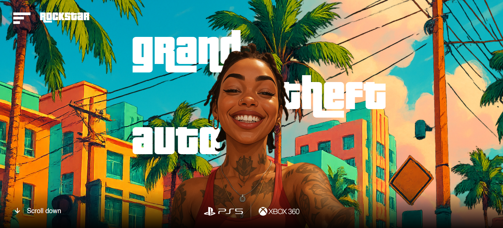

# 🎮 GTA VI Animated Website (Fan Project)

An eye-catching, animated web experience inspired by Grand Theft Auto VI, created to sharpen my React.js skills and explore interactive front-end design. This fan project features smooth animations, dynamic cursor interactions, and a stylish landing & download page.

## 🚀 Live Demo

<a href="https://gta-vi-animated-react-website.vercel.app/">
        
    </a>

👉 [Visit Website](https://gta-vi-animated-react-website.vercel.app/)  
📦 _Project still in development_


> **Note:** This is a self-learning project and not affiliated with Rockstar Games.  
> Special thanks to **Sheriyan's Coding School** for helping me level up my React skills.

---


## 🎯 Project Overview

The GTA VI website features:

- 🏁 **Landing Page:** A vibrant hero section with a moving **Grand Theft Auto** title that follows the user's cursor horizontally.
- 📥 **Download Page:** A secondary page with sleek UI elements and download links styled like a modern game promotion site.
- 🏖️**Custom UI Design:** Inspired by the GTA Miami-vibe aesthetic.


## 🛠️ Tech Stack

- **Frontend:** React.js, HTML5, CSS3
- **Routing & Pages:** React Router
- **Styling:** Flexbox, Custom CSS Animations
- **Animation:** GSAP, TailwindCSS
- **Deployment:** Vercel

## 🧑‍🏫 Learning Journey

This project is part of my **React.js sharpening phase**.  
Big shoutout to **Sheriyan Coding School** for their beginner-to-advanced training and guidance on best practices in React and front-end design.

## 📦 How to Run Locally

```bash
git clone https://github.com/JassVirk4700/gta-vi-animated-website.git
cd gta-vi-animated-website
npm install
npm run dev
The app will run on http://localhost:3000

```

## 🚧 Future Enhancements

- Add dynamic transition between landing & download page
- Responsive design for different screen sizes
- Add background audio toggle button
- Optimize performance for lower-end devices
- Deploy on Vercel or Netlify

## 📄 License
This project is under the MIT License – feel free to use and remix with proper credit.

## 👨‍💻 Author
Made with ❤️ by Jass
Fan of Rockstar Games | React Enthusiast | Lifelong Learner